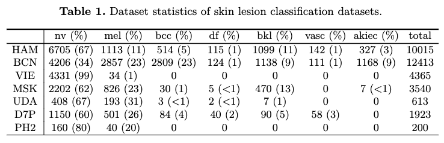

## Introduction

Data processing for datasets from different sources.

Here is the details of multi-domain skin leision datasets.

<br/> <div align=center></div>


## Data downloaded

HAM, BCN, VIE, MSK and UDA can be downloaded from [the link](https://challenge.isic-archive.com/data/). We utilized this [tool](https://github.com/ImageMarkup/isic-cli#isic-cli=), which is a executable toolbox, to download the whole dataset.

```
isic image download ./ISICdownload/Data/Images
```

Please also download the meta information (meta_v1.csv) from [this link](https://drive.google.com/file/d/1kML0WdOwBYydvovY0Xm7jDOAihS6MvOi/view?usp=sharing), which contains the data source information but is not avaiable anymore on the ISIC dataset.

We would download the raw data into the folder `/ISICdownload`.

D7P can be downloaded from [the link](https://derm.cs.sfu.ca/Welcome.html) after registration. We saved the raw data in the folder `/D7Pdownload`.

PH2 can be downloaded from [the link](https://www.fc.up.pt/addi/project.html) via a dropbox link. We saved the raw data in the folder `/PH2download`.

The raw data should be like:

```
ISICdownload/
├── Data/
  ├── meta_v1.csv
  ├── Images/
    ├── ISIC_0000000.jpeg
    ├── ...
    ├── ISIC_9999806.jpeg
    └── metadata.csv
D7Pdownload/
├── release_v0/
  ├── images
  └── meta
PH2download/
├── PH2Dataset/
  ├── PH2 Dataset images
  ├── PH2_dataset.txt
  └── PH2_dataset.xlsx
```

## Data preprocessing

If you want to reproduce all the results of this paper, the reader can run the processing code sequentially. Otherwise, choose what you want:

`SplitDatasetsFromISIC.ipynb`, which picks the six different datasets from ISIC arichive. (We exclude `SON` afterwards as it only contains one class)

`SplitHAMtrainval.ipynb`, which would split the dataset of HAM into train and test (which we take as the source dataset).

`MakeD7Pdataset.ipynb`, which would process the D7P dataset.

`MakePH2dataset.ipynb`, which would process the PH2 dataset.

`Generate_HAMtestc.ipynb`, which would generate sythesized test data with domain shifts using HAM (adpated from [cifar-10-c](https://github.com/hendrycks/robustness)).

After running the notebook, the processed datasets would be saved in `/SkinLesionDatasets` and `/SkinLesionDatasets_C`. The reader would expect folder like this:

```
SkinLesionDatasets/
├── HAMtrain/
├── HAMtest/
├── VIE/
└── ...
SkinLesionDatasets_C/
├── brightness/
├── contrast/
└── ...
```